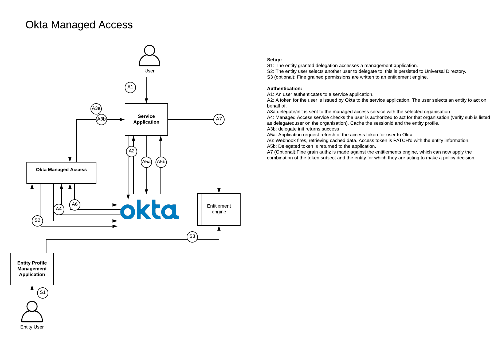

# Okta Managed Access

This demonstration allows you to delegate authority to another user within Okta.
The delegation of authority means that the user exercising the delegated
authority can extend their id and access tokens with the information contained
within the first user's profile.

## Architecture

This demonstration takes advantage of the Early Access feature "user types" to
create an "entity user" type which contains an additional profile attribute
which lists all the users which can exercise the authority of that entity. This
attribute could be applied globally to allow this behaviour on any account.

This project extends the architecture described in [Zee Khoo's Okta Delegate]
(https://github.com/zeekhoo-okta/oktadelegate) but removes the need for the
user exercising delegated priviledges to be a group admin of the target merely
nominated by them.

This architecture ensures that tokens always reflect the user for whom they
describe but enrich the tokens with data of the entity that user represents. All
delegation events pass through a signle point in the architecture which allows
for better audit. Finally only applications which are explicitly configured to
use an authorization server access policy with the delegation inline hook
enabled are able to be delegated.




## Deploying the service

### Tenant setup

#### User to User delegation

- Create a new user type for delegatable users.
- Add the profile string array attribute of "delegatedAgents".
- Add an inline token hook pointing to https://<serviceURI>/tokenEnrichment/agent
- Create a custom authorization server with the following custom claims:
    - can_delegate : access token: always : (user.delegatedAgents != null) ? "True" :
      "False"
- Create an access policy for the application which you wish to enable
  delegation for which calls the token inline hook.

### Deploy Service

#### Deploy Service to Heroku

[](https://heroku.com/deploy)

- Complete the config vars with the values from the tenant configuration
- Press  ```Deploy App```

#### Deploy Service Manually

- Clone this repository
- Create a .env file with the following content
```
TENANT=https://<yourtenant>
TOKEN=<your api token>
USER_TYPE_ID=<user type id>
DELEGATED_USER_TYPE_ID=<delegated user type id>
ENTITY_TYPE_ID=<entity user type id>
PORT=5000
TOKEN_AUD=<Token audience>
ISSUER=<token issuer uri>
SERVICE_AUTH_SECRET=<random>
DELEGATED_ACCESS_CLAIMS=
DELEGATED_IDENTITY_CLAIMS=
LOG_LEVEL=info
```
- Host the service at a public address
- Start the service with ```npm run start```

