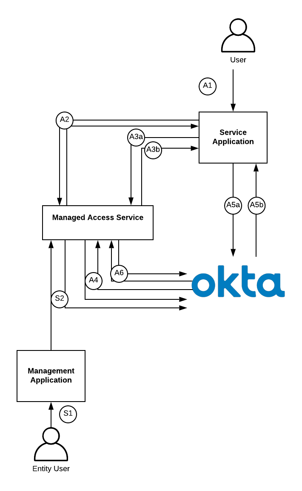

# Okta Managed Access

This service pattern allows you to delegate authority to another user within Okta.
The delegation of authority means that the user exercising the delegated
authority can extend their id and access tokens with the information contained
within the first user's profile.

:warning: Disclaimer: This project serves as a reference implementation, that
you can tweak or completely repurpose. It is community-supported and is not an
official Okta product and does not qualify for any Okta support. We makes no
warranties regarding this project. Anyone who chooses to use this project must
ensure that their implementation meets any applicable legal obligations
including any Okta terms and conditions.

## Architecture

This demonstration takes advantage of the "user types" feature to
create an "delegatable user" which contains an additional profile attribute
which lists all the users which can exercise the authority of that user. This
attribute could be applied globally to allow this behaviour on any account.

This project extends the architecture described in [Zee Khoo's Okta Delegate]
(https://github.com/zeekhoo-okta/oktadelegate) but removes the need for the
user exercising delegated priviledges to be a group admin of the target merely
nominated by them.

This architecture ensures that tokens always reflect the user for whom they
describe (the sub claim is always accurate) but enriches the tokens with data of
the user who granted authority. All delegation events pass through a single
point in the architecture which allows for better audit. Finally only
applications which are explicitly configured to use an authorization server
access policy with the delegation inline hook enabled are able recieve a
delegated token.



### Setup
- S1: The user granting delegated access authenticates to a management application
  connected to the this service.
- S2: The user select another user for delegated access, this is sent to this
  service and persisted into the user's universal directory under the
  delegated_agents attribute.

### Exercising delegation

- A1: A user authenticates to the service application. A token for that user is issued by the Okta authorization server.
- A2: The application uses the user's token to call this service to retrieve a list of users who have
  delegated access.
- A3a: The user selects from the returned list and a delegation initiate is made
  to this service.
- A4: This service revalidates with Okta that the user has been granted
  delegated access
- A3b: This service caches the delegating users id and returns a delegationid to the application.
- A5a: The application sends the delegationid as state in call to refresh of the user's
  access token with the authorization server.
- A6: The authorization server access policy is followed if the application,
  scopes and user group membership match the inline hook is fired to the managed
  access service with the content of the token so far. The managed access
  service identifies the delegationid provided in the state and links this with the delegation init
  request. The delegated user's attributes are patched into the token.
- A5b: The delegated token is returned to the application.

A delegated access token will always contain three additional claims:
```
can_delegate: False
on_behalf: True
on_behalf_sub: <the sub of the delgating user>
```

Consuming services can use the second of these claims to identify delegated
tokens and the third to identify the user on behalf the user is acting.

Additional attributes from the delegating users profile can be added to both 
the access and identity tokens by configuring the ```DELEGATED_ACCESS_CLAIMS``` 
and ```DELEGATED_IDENTITY_CLAIMS``` variables.

## Deploying the service

### Tenant setup

#### User to User delegation

- Create a new user type for delegatable users.
- Add the profile string array attribute of "delegatedAgents".
- Add an inline token hook pointing to https://<serviceURI>/tokenEnrichment/agent
- Create a custom authorization server with the following custom claims:
    - can_delegate : access token: always : (user.delegatedAgents != null) ? "True" :
      "False"
- Create an access policy for the application which you wish to enable
  delegation for which calls the token inline hook.

### Deploy Service

#### Deploy Service to Heroku

[](https://heroku.com/deploy)

- Complete the config vars with the values from the tenant configuration
- Press  ```Deploy App```

#### Deploy Service Manually

- Clone this repository
- Create a .env file with the following content
```
TENANT=https://<yourtenant>
TOKEN=<your api token>
USER_TYPE_ID=<user type id>
DELEGATED_USER_TYPE_ID=<delegated user type id>
ENTITY_TYPE_ID=<entity user type id>
PORT=5000
TOKEN_AUD=<Token audience>
ISSUER=<token issuer uri>
SERVICE_AUTH_SECRET=<random>
DELEGATED_ACCESS_CLAIMS=
DELEGATED_IDENTITY_CLAIMS=
LOG_LEVEL=info
```
- Host the service at a public address
- Start the service with ```npm run start```

## Implementing Clients

The API is documented with OpenAPI Specification
[here](https://app.swaggerhub.com/apis-docs/andy.march/Okta-Managed-Access/1.0.0)
an example client is available in the repository [here](https://github.com/andymarch/Token-Brand-Demo/tree/Delegation).

